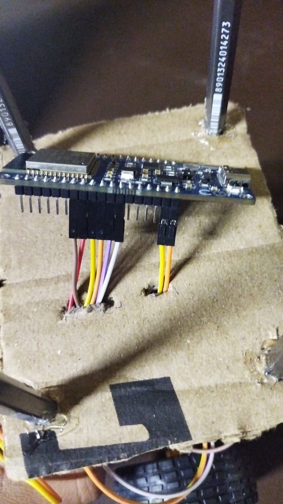
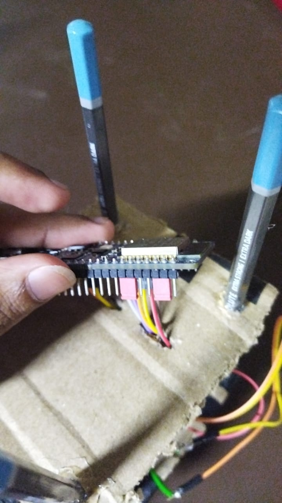
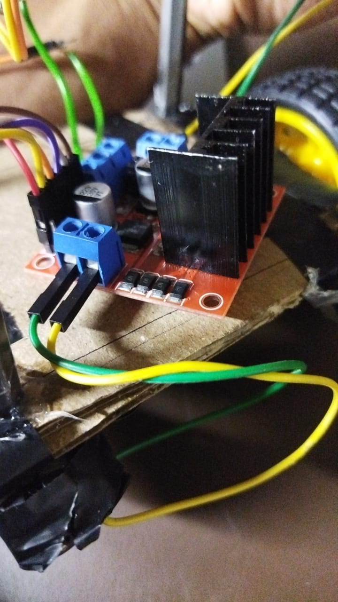
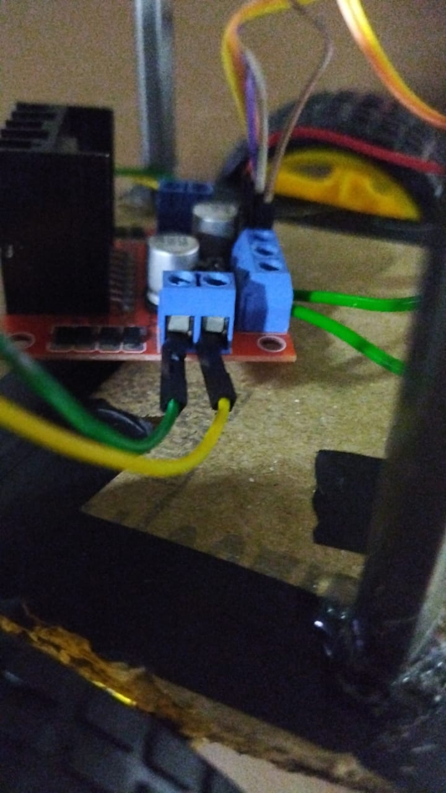
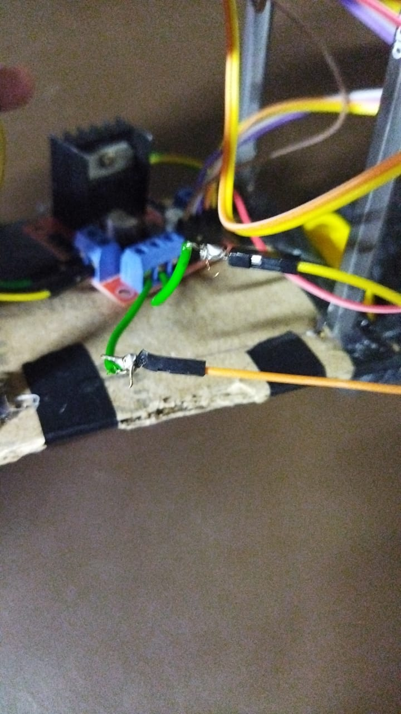

# Self-Balancing-Robot

This is a simple attempt at making a self-balancing robot using the electronics club (CFI IITM) ESP32 Dev board. 

The Dev Board has an MPU6050 IMU sensor embedded in it, that we can use using the Adafruit MPU6050 library. Also, we will be using L298N motor drivers. All of the connections to the motor driver and ESP32 have been shown in the pictures below. (Along with the overall bot)

